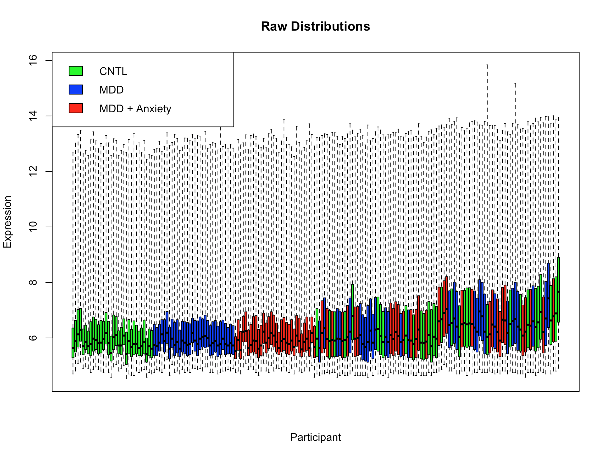
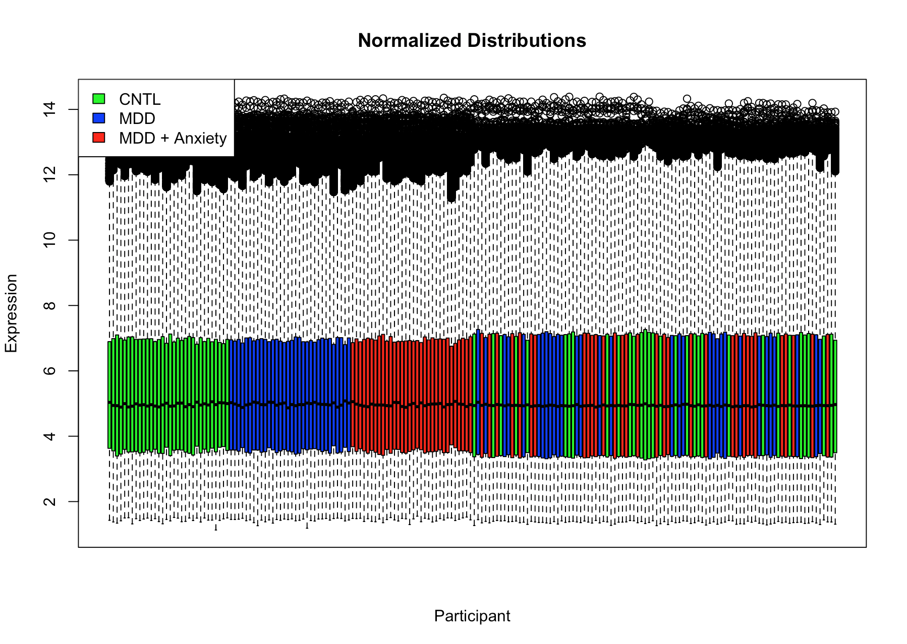
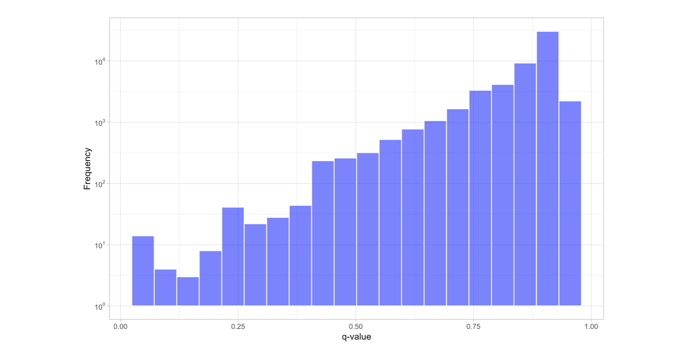
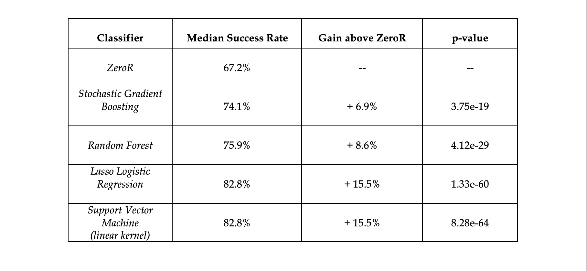
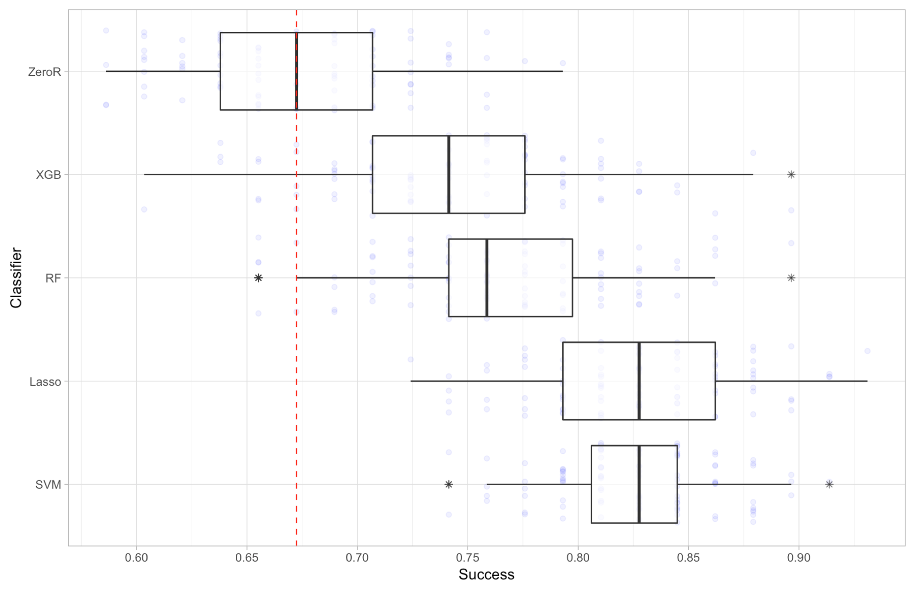
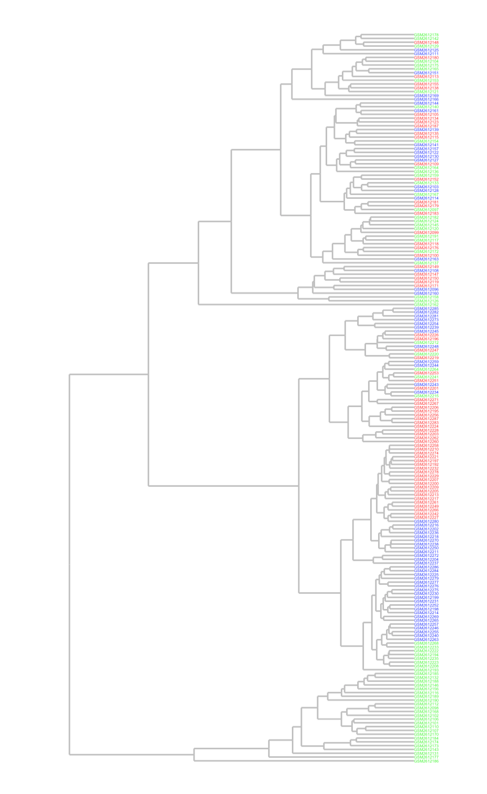
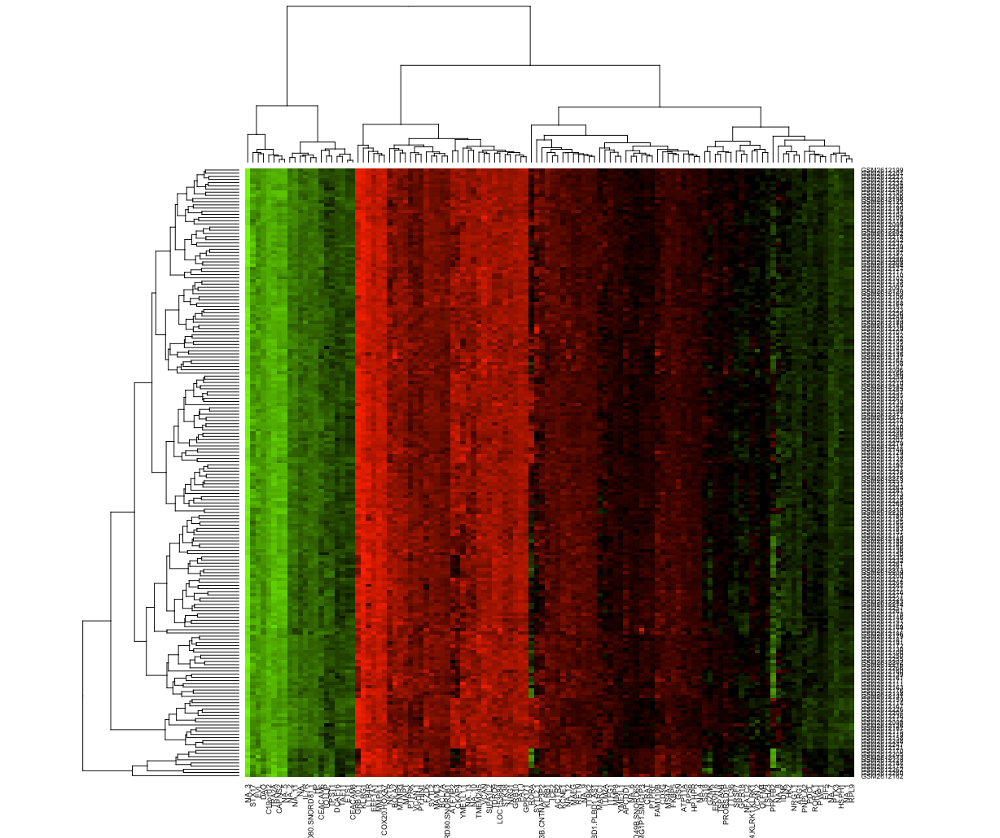
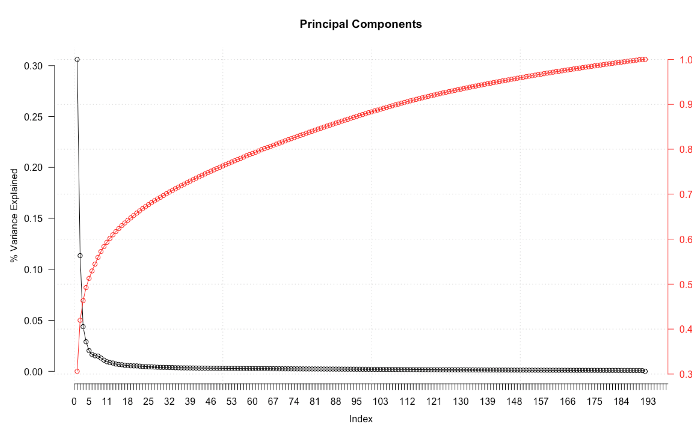
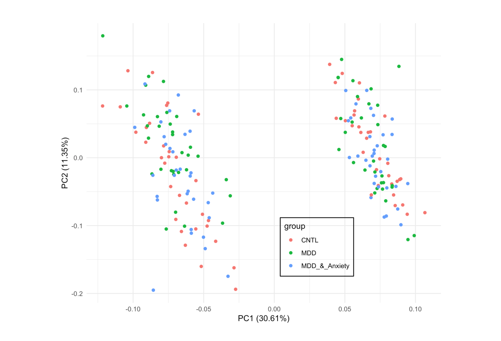
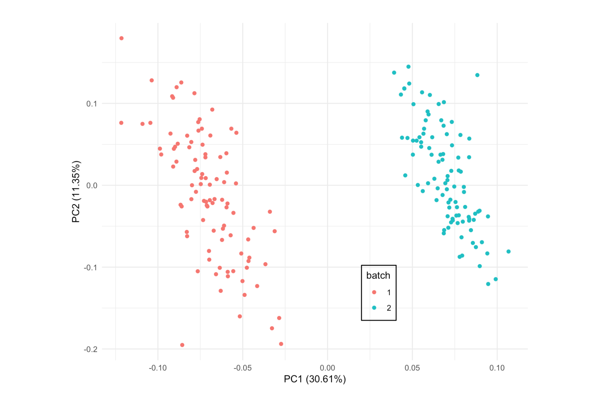

# Depression Biomarker Project 

### Background

Clinical depression places an enormous social and economic toll on the developed world. This increasingly prevalent disorder remains a leading source of morbidity and mortality, yet its standard of care has been slow to evolve in the past half century.1 Diagnostic criteria continue to rely largely on behavioral observations to guide participant classification and perpetuate imprecise, trial-and-error treatment for much of the affected population.2

The National Institute for Mental Health has recognized a pressing need for more robust diagnostic methods and fuller understanding of psychiatric disorders’ biological mechanisms, giving rise to the Research Domain Criteria.3 This novel research framework prioritizes an integrative understanding of psychiatric illness across a number of mechanistic levels – from genes, macromolecules, and cells to circuits, physiology, and behavior. As a part of its mission to accelerate Psychiatry into the arena of precision medicine, the RDoC initiative aggregates clinical data to discover measurable biomarkers that can inform early detection and therapeutic intervention.4

In pursuit of such of such biomarkers, a growing body of research has uncovered a strong link between chronic inflammation and clinical depression.5 The neuroimmune hypothesis originating from this research describes how elevated peripheral inflammation—whether induced by chronic stress or acute infection—can infiltrate the central nervous system to disrupt neurotransmitter metabolism, neuroendocrine sensitivity, and microglial function. All of these downstream dysregulations can collectively precipitate the heterogenous set of behavioral symptoms that characterize clinical depression. Such findings suggest that a blood-based biomarker panel may help identify and stratify participants with clinical depression, potentially aiding in the development of more preventative and personalized standard of mental healthcare.

###  Specific Aims

This project used  microarray [data](https://www.ncbi.nlm.nih.gov/geo/query/acc.cgi?acc=GSE98793) published in a [2017 Biological Psychiatry study](https://www.ncbi.nlm.nih.gov/pmc/articles/PMC5720346/pdf/main.pdf) to 

1) Discover a panel of genes that distinguish clinically depressed participants from healthy controls
2) Train predictive models to distinguish clinically depressed participants from healthy controls.
3) Stratify the participant population into biologically meaningful subgroups.

### Data Source

The dataset used for this project features 54,676 microarray (Affymetrix Human Genome U133 plus 2.0) probes measured from whole blood samples of 192 participants. These data were aggregated from two independent case-control studies of clinical depression: the GlaxoSmithKline–High-Throughput Disease-specific target Identification Program [GSK-HiTDiP] study and a Janssen–Brain Resource Company study. These studies used a Mini-International Neuropsychiatric Interview to diagnose participants with clinical depression and/or generalized anxiety disorder. 128 participants were diagnosed with major depressive disorder (MDD). 64 of these participants with MDD were also diagnosed with generalised anxiety disorder. The remaining 64 participants served as healthy controls (CNTL).  

Prior to analysis, these data were quantile normalized as seen in **Figures 1 & 2**. **Figure 1** reveals potential batch effects between the GSK-HiTDiP and Janssen–BRC studies, as suggested by the discrepancies in group order and sample varience.

**Figure 1.** Boxplot distributions of raw gene expression values for each participant before quantile normalization.

**Figure 2.** Boxplot distributions of quantile normalized gene expression values for each participant. The shape and spread of each distribution is nearly equivalent. 

### Differential Expression Analysis

To determine which genes were significantly differentially expressed between the MDD and CNTL groups, q-values were calculated for each of the 54,676 gene probes, as seen in **Figure 3**.

**Figure 3**. Histogram of probe q-values.

### Dimmension Reduction

Using an q-value cutoff of 0.35, a truncated dataset containing the 177 most differentially expressed genes was generated for participant classification and stratification.

### Participant Classification

Four machine learning algorithms were trained to distinguish MDD participants from CNTL participants using the truncated dataset. This dataset was repeatedly (100x) randomly split into training (70%) and validation (30%) subsets. In each of these validation trials, the classification algorithms were trained and tested to generate distributions of classification success rates for each algorithm. 

t-tests (unequal variance) were performed to compare each algorithm's classification success rate distribution to a baseline zeroR distribution. The performance of each classifier is summarized the table below and in **Figure 4**. 
  

  

  
**Figure 4.** Comparison of binary classifiers (stochastic gradient boosting, random forest, lasso logistic regression, support vector machine with linear kernel) fit and tested in 100 validation trials. Each boxplot displays a distribution of success rates from all of these validation trials. Success is defined as the proportion of correctly classified participants in each test dataset. Vertical red line represents baseline classification success rate achieved using zeroR classifier.

### Participant Stratification

Hierarchical clustering was performed on the truncated dataset with correlation as a distance metric. As seen in **Figure 5**, no clinically meaningful participant clusters emerged clearly. **Figure 6** shows probes clustered into general upregulated and downregulated groups. However, since these up/downregulation patterns are uniform across patients groups, they remain clinically uninformative. 
  
Principal component analysis was performed on the full dataset, as summarized in **Figure 7**. **Figure 8** shows that two hetergogenous clusters of patients emerge. These clusters are not clinically meaningfull, however. **Figure 9** reveals that these clusters result from batch effects between the two data sources (GSK-HiTDiP and Janssen–BRC studies).

Unfortunatly, both of these stratification analyses failed to discover biologically meaningful patient subgroups.

**Figure 5.** Dendrogram of clustered participants. Healthy controls in green. MDD participants in blue. MDD participnts with anxiety in red.
  

**Figure 6.** Heat map of normalized gene expression for 117 most differentially expressed probes.
  

**Figure 7.** Elbow plot displays proportion of variance explained by principal components. Cumulative proportion of variance explained plotted in red.  

**Figure 8.** Clusters of participants plotted against first two principal components of the full dataset. 
  

**Figure 9.** Clusters of participants plotted against first two principal components of the full dataset. Evidence of batch effects. 

### References 

1)	Cassano, P., & Fava, M. (2002). Depression and public health: an overview. Journal of psychosomatic research, 53(4), 849-857.

2)	American Psychiatric Association. (2013). Diagnostic and statistical manual of mental disorders (DSM-5®). American Psychiatric Pub.

3)	Insel, T., Cuthbert, B., Garvey, M., Heinssen, R., Pine, D. S., Quinn, K., ... & Wang, P. (2010). Research domain criteria (RDoC): toward a new classification framework for research on mental disorders.

4)	Tenenbaum, J. D., Bhuvaneshwar, K., Gagliardi, J. P., Fultz Hollis, K., Jia, P., Ma, L., ... & Zhao, Z. (2017). Translational bioinformatics in mental health: open access data sources and computational biomarker discovery. Briefings in bioinformatics.

5)	Miller, A. H., Maletic, V., & Raison, C. L. (2009). Inflammation and its discontents: the role of cytokines in the pathophysiology of major depression. Biological psychiatry, 65(9), 732-741.

